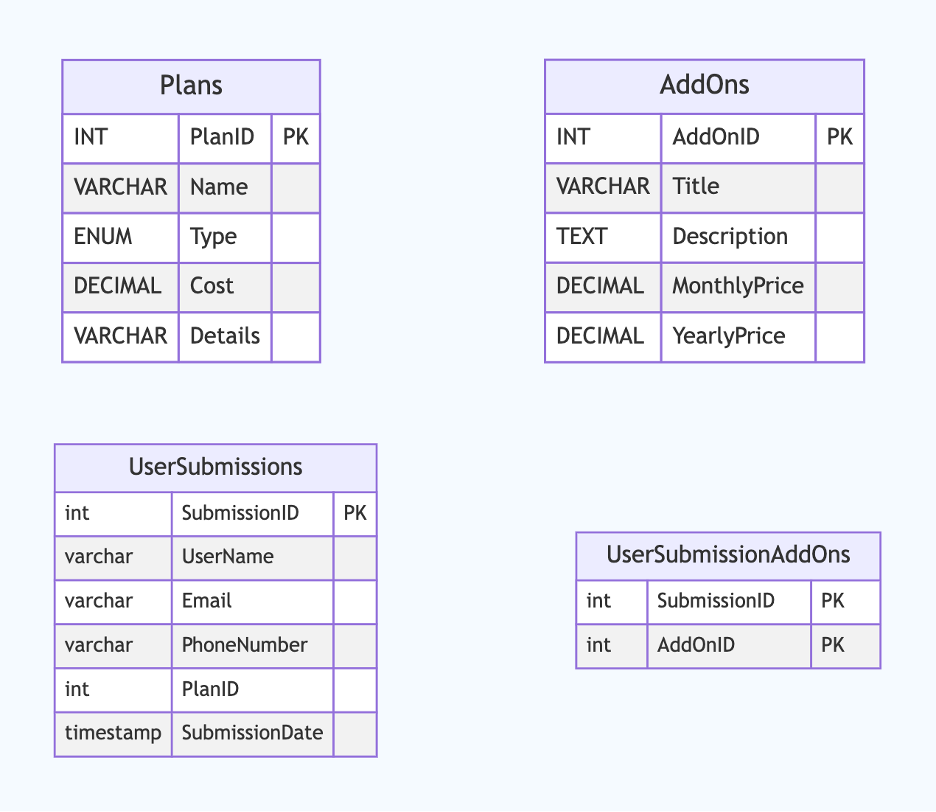

# Database Schema Overview

The schema consists of two primary tables: `Plans` and `AddOns`.

## Tables

### Plans Table

The `Plans` table stores information about subscription plans offered by the service. It includes the following fields:

- **PlanID**: (INT, Primary Key) A unique identifier for each plan.
- **Name**: (VARCHAR(50)) The name of the plan, such as Arcade, Advanced, or Pro.
- **Type**: (ENUM('Monthly', 'Yearly')) The type of billing cycle for the plan, either monthly or yearly.
- **Cost**: (DECIMAL(6, 2)) The cost of the plan in the specified currency.
- **Details**: (VARCHAR(100)) Additional details about the plan, such as promotional information or special features that will be presented in the UI.

### AddOns Table

The `AddOns` table contains information about additional services or features that can be added to subscription plans. It includes the following fields:

- **AddOnID**: (INT, Primary Key) A unique identifier for each add-on.
- **Title**: (VARCHAR(100)) The title of the add-on, such as Online Service or Large Storage.
- **Description**: (TEXT) A detailed description of what the add-on offers.
- **MonthlyPrice**: (DECIMAL(6, 2)) The cost of the add-on when billed monthly.
- **YearlyPrice**: (DECIMAL(6, 2)) The cost of the add-on when billed yearly.

### UserSubmissions Table

The `UserSubmissions` table records user submissions, including personal information and selected plans. It includes the following fields:

- **SubmissionID**: (INT, Primary Key) A unique identifier for each submission.
- **UserName**: (VARCHAR(100), NOT NULL) The name of the user making the submission.
- **Email**: (VARCHAR(100), NOT NULL) The user's email address.
- **PhoneNumber**: (VARCHAR(15)) The user's phone number.
- **PlanID**: (INT, NOT NULL) A foreign key referencing the `Plans` table to associate a submission with a selected plan.
- **SubmissionDate**: (TIMESTAMP) The date and time of the submission, defaulting to the current timestamp.

### UserSubmissionAddOns Table

The `UserSubmissionAddOns` table links user submissions to their selected add-ons. It includes the following fields:

- **SubmissionID**: (INT) A foreign key referencing the `UserSubmissions` table.
- **AddOnID**: (INT) A foreign key referencing the `AddOns` table.

This table allows for multiple add-ons to be associated with a single user submission.



## Running and Connecting to the Database

Follow these steps to set up and connect to the MySQL database using Docker:

### Prerequisites
- Ensure you have Docker and MySQL Client installed on your system.
- Verify that the Docker service is running.

### Steps to Build and Run the Database

1. Navigate to the Database Directory:
   ```bash
   cd database/
   ```
2. Build the Docker Image: Build the Docker image for MySQL by running the following command:
   ```bash
   docker build -t my-mysql-image .
   ```
3. Run the Docker Container: Start a new Docker container with the following command:
   ```bash
   docker run -d -p 3306:3306 --name my-mysql-db -v my-db-data:/var/lib/mysql my-mysql-image
   ```
4. Connect to the MySQL Database: Use the following command to connect to the MySQL database:
   ```bash
   mysql -h 127.0.0.1 -P 3306 -u root -p
   ```
   Enter the password when prompted. You can find it in the Dockerfile under ENV MYSQL_ROOT_PASSWORD=rootpassword.
5. Once connected, select the database you want to use:
    ```bash
   USE net_nut_db;
   ```
   
## Notes

- The current `VARCHAR` length and `DECIMAL` precision is higher than presented in the examples, and can probably be modified and lowered.
- There is no direct relationship between `Plans` and `AddOns` in the given structure. However, in a more comprehensive system, you might consider creating a linking table to associate specific add-ons with specific plans, if needed.
- The table only supports two types of plans and prices (monthly and yearly). We could have defined it more generically and enforced the type in a backend code layer, instead of the database definition.
- We have the assumption that the cost is always saved in US dollars currency. The UI can present the price in different currencies based on the user-defined currency.
- We only save complete user submissions info. Meaning, partial filling of the multistep form won't be kept in the database.


# API Overview

This project also provides a RESTful API for managing subscription plans and add-ons, supporting standard CRUD operations.

### Endpoints

- **Plans**: Create, read, update, and delete subscription plans.
- **AddOns**: Create, read, update, and delete add-ons for subscription plans.

## Viewing the Swagger Documentation

To view the API documentation using Swagger UI locally using Docker:

   - Pull the Swagger UI Docker image:
     ```bash
     docker pull swaggerapi/swagger-ui
     ```
   - Inside the project directory, run the Swagger UI container:
     ```bash
     docker run -p 8080:8080 -e SWAGGER_JSON=/api/openapi.yaml -v "$(pwd)"/api/openapi.yaml:/api/openapi.yaml swaggerapi/swagger-ui
     ```
   - Open your web browser and go to `http://localhost:8080`.
